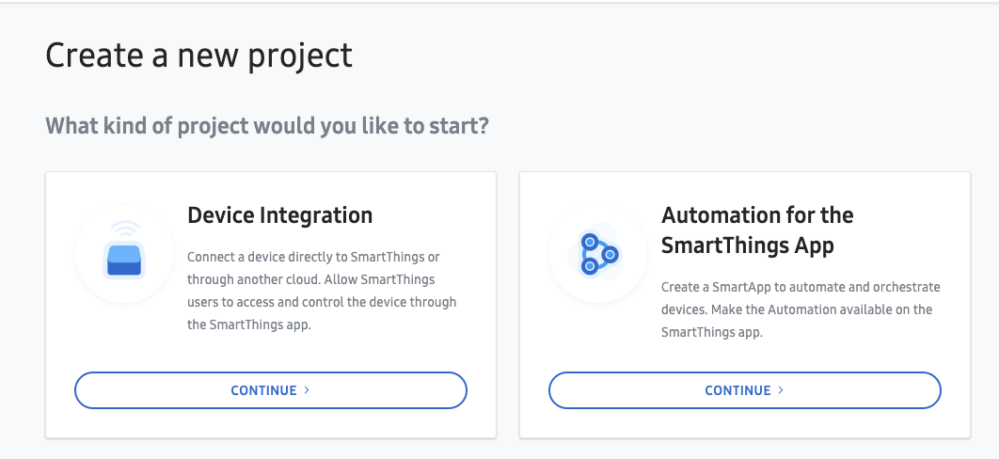
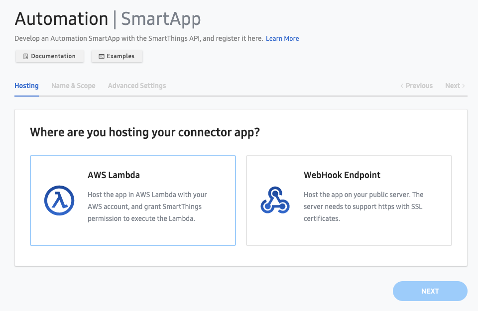

# Smartthings - Yale Smart Alarm Integration

This integration provides basic alarm synchronisation between the SmartThings Home Monitor and Yale.

Upon installing this SmartApp, your Yale alarm will subscribe to Home Monitor changes and update Yale accordingly.

## How to Deploy

### Prerequisites
* Install AWS CLI
* Install SmartThings CLI

1/ Create SmartApp in SmartThings Developer Console

Create a new project selecting the "Automation for the SmartThings App" type:


2/ Setup an AWS Account

https://aws.amazon.com/premiumsupport/knowledge-center/create-and-activate-aws-account/

3/ Clone this repo

4/ Install NPM dependencies
```
npm install
```

5/ Deploy with Serverless framework

Populate the below placeholders with your App ID, Yale Username and Password. Don't worry about the Client ID and Secret yet, they come later.
```
./node_modules/.bin/sls deploy \
 --param="appId=<YOUR_APP_ID>" \
 --param="clientId=TEMPCLIENTID" \
 --param="clientSecret=TEMPCLIENTSECRET" \
 --param="yaleUsername=<YALE_USERNAME>" \
 --param="yalePassword=<YALE_PASSWORD>"
```
Grant SmartThings cloud permission to invoke your new Lambda
`aws lambda add-permission --profile personal --function-name <name-of-your-lambda-function> --statement-id smartthings --principal 906037444270 --action lambda:InvokeFunction`

Get the AWS Resource Name of the newly created function

6/ Configure an AWS Lambda integration in your SmartApp

On the main page in the Developer Console, click the "Register App" button and select the AWS Lambda option


Keep a record of the App Id, Client Id and Client Secret generated when creating the project

7/ Update Lambda function with Client ID and Secret

```
./node_modules/.bin/sls deploy \
 --param="appId=<YOUR_APP_ID>" \
 --param="clientId=<YOUR_ST_CLIENT_ID>" \
 --param="clientSecret=<YOUR_ST_CLIENT_SECRET>" \
 --param="yaleUsername=<YALE_USERNAME>" \
 --param="yalePassword=<YALE_PASSWORD>"
```

Download the OAuth configuration for your new app

`smartthings apps:oauth 30a3df02-beda-48d1-9dfb-87efc6219baa -j > appOauth.json`

Replace the scope you added previously with the following scope

`r:security:locations:*:armstate`

Save and re-publish the OAuth config:

`smartthings apps:oauth:generate 30a3df02-beda-48d1-9dfb-87efc6219baa -i appOauth.json`

8/ Install app from SmartThings App

In the event you get two entries for the SmartApp you've created, pick the one with no description. At the time of writing this was a known bug with the SmartThings App.

All that's needed here is to press the "Done" button - in this first iteration all the required details are passed into the Lambda creation step.

## TODO

* Oauth integration (username and password are used once with access & refresh tokens subsequently used)
* Basic unit tests
* Yale Device polling and management from SmartThings
* Add SmartThings principal addition to Serverless deployment